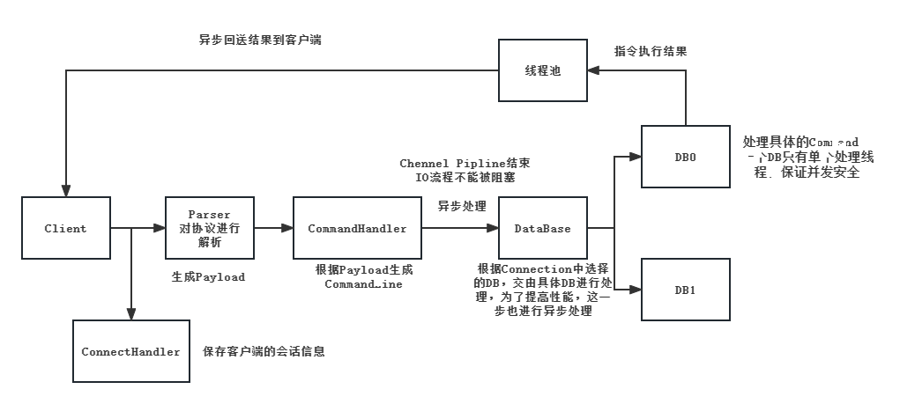

# Create a Redis Using Java

## 解析RESP（Redis Serialization Protocol）

### 正常回复
以+开头，以\r\n结尾的字符串形式

例如：+OK\r\n

### 错误回复
以-开头，以\r\n结尾的字符串形式

例如：+Error message\r\n

### 整数
以:开头，以\r\n结尾的字符串形式

例如：:123456\r\n

### 多行字符串
以$开头，后面跟实际发送字节数，以\r\n结尾

例如：

$11\r\nhello world\r\n

$0\r\n\r\n

$12\r\nhello\r\nworld\r\n

### 数组
以*开头，后面跟成员个数

例如：

set key value

*3\r\n$3\r\nset\r\n$3\r\nkey\r\n$5\r\nvalue\r\n

### 自定义传输格式

为了更加方便地解决TCP拆包粘包问题，在每次数据传输之前，添加4个Byte，也就是一个
int(Integer)，来记录RESP数据的长度。

所以Netty传输的数据格式就是：RESPLength + RESP。

## TinyRedis业务处理流程
